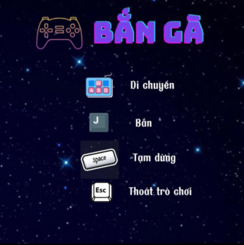

# Bắn Gà

## Mô tả chung
  Game có tên là Bắn Gà, được viết bằng ngôn ngữ C++ và sử dụng thư viện hình ảnh SDL2. Trò chơi dựa trên game "Chicken Ivaders" - 1 trò chơi nổi tiếng có cả ở trên máy tính và điện thoại.
  
  
## Luật chơi
  - Game có 10 wave quái. Nếu vượt qua 10 wave đó, bạn sẽ giành chiến thắng.
  - Ở wave thứ 5, sẽ xuất hiện 1 spell bất kì (đạn 2, đạn 3, ...).
  - Wave cuối cùng sẽ là boss.
  - Người chơi chỉ có duy nhất 1 mạng.

## Cách chơi
  - `w` `a` `s` `d` được sử dụng để di chuyển
  - `j` để bắn đạn
  - `Spacebar` để tạm dừng trận đấu
  - `Esc` để thoát game
  
  
  

## Hướng dẫn cài đặt
  - Download zip [Game-Ban-Ga-main.zip](https://github.com/tumo2208/Game-Ban-Ga/archive/refs/heads/main.zip)
  - Giải nén file và Mở folder bin -> Debug -> Ban-Ga.
  
  

  
  
  
  
  

  
##  DEMO

Link youtube : https://www.youtube.com/watch?v=UawxA7BZicE

https://user-images.githubusercontent.com/125242554/230730272-0670ce06-0921-4d99-8cb1-2fef50197246.mp4

